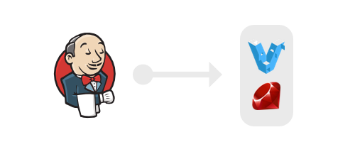

# Jenkins Box

Setup a VM with Jenkins ready to be used as a CI server for ruby development.

## Features

- [Jenkins](http://jenkins-ci.org/) with port forwarding to port 8080
- Build [Ruby](http://www.ruby-lang.org/) projects using [RVM](http://rvm.io/)
- Backup + Versioning of Jenkins Configuration using [grunt-jenkins](http://github.com/sghill/grunt-jenkins)

## Getting Started

Ensure that the dependencies are setup and then just execute:

    ./bootstrap.sh

When everything went fine start yout VM:

    vagrant up

Then open your browser and visit jenkins:

    open http://localhost:8080

## Manage Jenkins configuration

After each time you made changes to the global Jenkins configuration, plugins or jobs just do:

    grunt jenkins-backup

This will backup all stuff to the jenkins-configuration folder. You may put it under version control, yay!

You can install jenkins configuration using:

    grunt jenkins-install

When you added / removed plugins you must restart Jenkins:

    open http://localhost:8080/safeRestart

## Dependencies

- Vagrant 1.2+
- Ruby + Bundler
- Chef + Berkshelf
- Node + NPM

## License

Copyright (c) 2013 Jens Bissinger. See [LICENSE.txt](LICENSE.txt).
